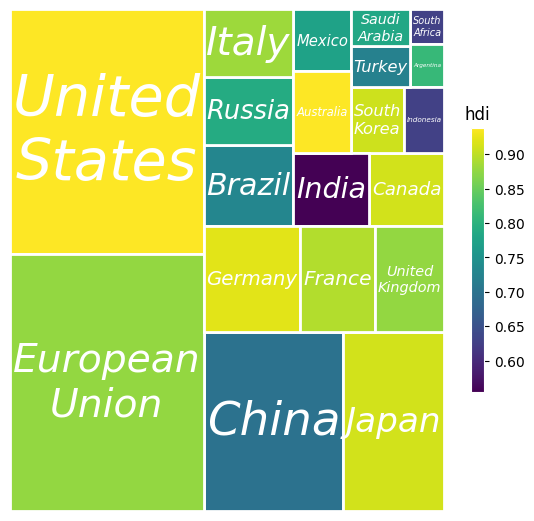
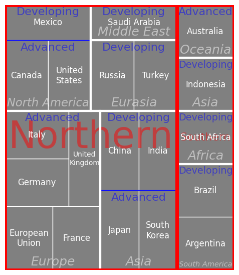

# matplotlib-extra

This package includes some extra functions to matplotlib.

Currently there includes the following usefull functions:

* `AutofitText` class from `AutofitText` module, which can auto-fit the text into a box region, which is specified by *width* x *height* at the text position *(x,y)*

* `treemap` from `treemap` module, which plots a treemap. It supports the hierarchical treemap. Its labels use the `AutofitText` class to auto fit the text into the tiles. For usage, please see the docstrings in the source code and the examples in the jupyter notebook.

# Examples
## Treemap

1. With one level

   

2. With multi-levels
   
   
   

3. Split at the first level
   
   

4. Add some pads between the parent tiles and children tiles, and label the parent tiles
   
   

For the source code to generate the above figure, please see the [examples](./examples/example.ipynb)